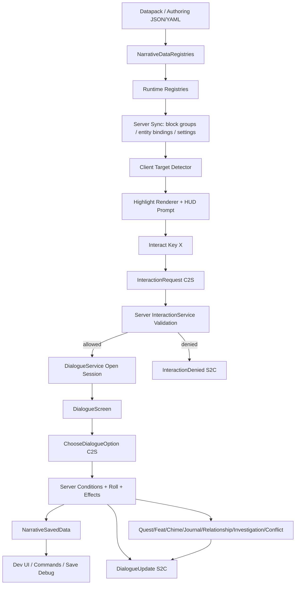

# GOAL.md — Minecraft Disco-like CRPG Mod: Architecture + Product Plan

This file is intended to be copied to the repository root as `GOAL.md` so a Codex-style agent can read it with `/goal` and continue implementation without asking for context.

Project codename in the existing repo: **Ebb** / **Esoteric Ebb CRPG**  
Minecraft target: **Java Edition 26.1.2**  
Loader stack: **Fabric Loader + Fabric API + Fabric Loom**  
Language/runtime: **Java 25**  
Primary external runtime dependency: **GeckoLib 5.5.1** for humanoid/NPC animation

---

## 1. Agent Operating Contract

### 1.1 Immediate rule

Do **not** migrate this project to NeoForge, Minecraft 1.21.x, Kotlin, Architectury, or a new loader stack. The current repository is already a Fabric 26.1.2 / Java 25 implementation with many systems complete. Extend it in place.

### 1.2 First actions after `/goal`

From the repository root:

```bash
git status --short
sed -n '1,260p' GOAL.md || true
sed -n '1,260p' .kiro/plan/task_plan.md || true
sed -n '1,260p' docs/json_authoring_guide.md || true
scripts/gradle-local.sh --no-daemon build
scripts/gradle-local.sh --no-daemon validateEbbData
```

If any command fails, fix the failing baseline before starting new feature work.

### 1.3 Mandatory verification before considering work complete

Run the strongest available subset, preferring all of these:

```bash
python3 scripts/goal_static_audit.py
python3 scripts/deep_research_static_audit.py
python3 scripts/third_review_static_audit.py
scripts/compile_authoring_sources.py --clean
scripts/gradle-local.sh --no-daemon test
scripts/gradle-local.sh --no-daemon validateEbbData
scripts/gradle-local.sh --no-daemon runGametestServer --args nogui
scripts/run_smoke_checks.sh
git diff --check
```

If GUI tooling is present and the environment supports it:

```bash
scripts/run_gui_automation_smoke.sh
python3 scripts/gui_e2e_run.py --scenario runtime_check
python3 scripts/gui_e2e_run.py --scenario gui_retest
```

Do not claim GUI verification passed unless the GUI automation or a human-operated run actually ran against the refreshed jar.

### 1.4 Coding rules

1. Keep all game-state decisions server-authoritative.
2. Keep content data-driven through JSON/YAML authoring, not hard-coded story logic.
3. Every new dialogue check must fail forward unless explicitly marked as a harmless optional check.
4. Every new data registry must be visible through `/ebb data` and `/ebb dev` or a comparable dev inspection path.
5. Every new persisted field must be covered by codec/load-save testing and schema migration notes.
6. Every player-visible state change must have a dialogue status echo or a UI surface.
7. Do not make all entities interactable by default. Entity interaction must come from explicit bindings, tags, names, UUIDs, or entity type rules.
8. Do not bypass line-of-sight and distance validation on the server.
9. Do not break dedicated-server mode. Client-only classes stay under `src/client/java`.
10. Do not remove old aliases casually; many authoring/data files intentionally preserve legacy aliases.

---

## 2. Product Vision

Build a **Disco-like Minecraft CRPG framework and playable story mod** centered on:

- close-range embodied exploration in Minecraft spaces;
- crosshair-based investigation of entities and block groups;
- dialogue, action, and thought choices;
- d20 checks with success, failure, critical success, and critical failure branches;
- failure-forward writing;
- layered story variables;
- Quest Branch / Take Root / Feat growth;
- inner-voice “Chime” passive inserts;
- journal, clues, investigation scenes, NPC relationships, and set-piece conflicts;
- data-pack-like authoring so new rooms, NPCs, and story packs can be built without editing Java.

The project should not become a generic quest-marker mod. It should become a **Minecraft-native CRPG conversation/investigation engine** with one high-density vertical slice proving the design.

---

## 3. Design Pillars from the Research Report

These are non-negotiable product constraints.

### Pillar A — Failure is content, not blockage

A failed roll must normally produce one or more of:

- a new clue;
- a relationship or NPC memory change;
- a world/story variable change;
- a changed DC later;
- a quest branch mutation;
- a different conflict state;
- an embarrassing, revealing, or self-defining line of text;
- a route to proceed with cost.

A failed roll must not simply say “you failed” and return to the same state unless it is a low-stakes optional flavor roll.

### Pillar B — Tasks are build sources

Major quest branches should not merely reward XP or items. They should “Take Root” and permanently shape player build or roleplay through Feats, traits, Chime unlocks, relationship modifiers, or future check modifiers.

### Pillar C — Variables are layered

Use three narrative layers:

- **Branch**: route/ending commitments and major world-line decisions.
- **Major**: NPC relationship pivots, quest commitments, recurring scene state.
- **Minor**: local scene flags, one-room details, small DC modifiers, local dialogue memory.

Do not create a flat uncontrolled bag of flags for important narrative state.

### Pillar D — Dialogue is the main combat surface

Traditional Minecraft combat can exist in the world, but the CRPG mod’s authored conflict should occur primarily through dialogue/event chains: turn-like choices, stress/resolve scores, HP-like or relationship-like costs, clue-gated options, and fail-forward branches.

### Pillar E — UI is a rhythm controller

Dialogue UI must manage reading pace, status echoes, roll feedback, Chime interruption, clue gains, quest/feat changes, and history scroll. It is not just a text box.

### Pillar F — Dense small world over broad empty world

Prefer one high-density tavern, street, ruin, church, or office with many authored reactions over a large low-density map.

---

## 4. Current Repository Facts

### 4.1 Stack

Current pinned stack from project configuration and planning files:

```properties
minecraft_version=26.1.2
loader_version=0.19.2
fabric_api_version=0.150.0+26.1.2
loom_version=1.17.0-alpha.13
geckolib_version=5.5.1
mod_version=0.1.0-dev
maven_group=com.crpg
archives_base_name=ebb
mod_id=ebb
mod_name=Esoteric Ebb CRPG
```

`fabric.mod.json` entrypoints:

```json
{
  "main": ["com.crpg.ebb.EbbMod"],
  "client": ["com.crpg.ebb.client.EbbClient"],
  "fabric-gametest": ["com.crpg.ebb.test.EbbGameTests"]
}
```

### 4.2 Root project structure

Expected root folders/files:

```text
build.gradle
settings.gradle
gradle.properties
fabric.mod.json via src/main/resources
src/main/java/com/crpg/ebb/...
src/client/java/com/crpg/ebb/client/...
src/test/java/...
src/main/resources/assets/ebb/...
src/main/resources/data/ebb/...
docs/
authoring/
scripts/
tools/
.github/
.kiro/plan/
```

### 4.3 Existing high-level completion state

The existing project is **not a blank skeleton**. The planning docs indicate these systems are already implemented or largely implemented:

- Fabric/JDK25/GeckoLib project skeleton.
- JSON reload registries.
- `/ebb`, `/ebb status`, `/ebb data`.
- Crosshair target detection within 10m.
- Block-group and entity target validation.
- Highlight renderer and `按 [X] 互动` HUD prompt.
- C2S/S2C packets for interaction and dialogue.
- Dialogue JSON parser, sessions, UI, choice types, and branching.
- d20 checks with critical outcomes and server-side resolution.
- Narrative persistence for player and world state.
- OP developer mode and dev snapshots.
- Custom `ebb:npc` entity, GeckoLib hooks, routines, look-at-player behavior.
- Data-driven interaction settings and server-to-client sync for block groups/entity bindings.
- Story Variables: Branch / Major / Minor.
- Quest Branch / Take Root / Feat runtime and UI.
- Chime / inner voice passive inserts.
- Journal/clue UI.
- Relationship, NPC memory, time-window conditions, routine switching.
- Investigation scenes, clue-to-check modifiers, set-piece conflict state.
- A playable tavern vertical slice with multiple NPCs and interaction points.
- Authoring compiler for YAML/JSON sources.
- JUnit, GameTest, smoke/static audits, and GUI automation scaffolding.

Older phase audit files may say “manual GUI retest pending”; later planning status indicates a GUI automation final visual pass was added. When in doubt, trust the most recent `task_plan.md`, runtime logs, and current jar/profile evidence.

---

## 5. Architecture Overview



### 5.1 Initialization path

`com.crpg.ebb.EbbMod` is the common entrypoint. It should initialize in this order:

1. entity types;
2. packets;
3. data reload listeners;
4. dialogue lifecycle events;
5. interaction sync lifecycle events;
6. commands.

Current entrypoint pattern:

```java
ModEntityTypes.register();
ModPackets.register();
NarrativeDataRegistries.registerReloadListeners();
DialogueService.registerLifecycleEvents();
InteractionSyncService.registerLifecycleEvents();
ModCommands.register();
```

Client entrypoint `EbbClient` should only register client-side systems: target detector, key mappings, networking receivers, HUD, highlight renderer, dialogue/journal/quest/dev screens, and NPC renderer.

### 5.2 Data layer

Core principle: Java code defines runtime contracts and validation; story content lives in data.

Important registries:

```text
com.crpg.ebb.data.JsonDataRegistry
com.crpg.ebb.data.NarrativeDataRegistries
com.crpg.ebb.dialogue.DialogueRegistry
com.crpg.ebb.interaction.BlockGroupIndex
com.crpg.ebb.interaction.entity.EntityBindingRegistry
com.crpg.ebb.routine.NpcRoutineRegistry
com.crpg.ebb.quest.QuestBranchRegistry
com.crpg.ebb.feat.FeatRegistry
com.crpg.ebb.chime.ChimeRegistry
com.crpg.ebb.journal.JournalEntryRegistry
com.crpg.ebb.relationship.RelationshipRegistry
com.crpg.ebb.investigation.InvestigationRegistry
com.crpg.ebb.conflict.ConflictRegistry
```

All new registries must:

- parse from `data/<namespace>/<registry_path>/**/*.json`;
- reject invalid IDs or missing references;
- collect validation messages;
- survive `/reload` without crashing the server;
- be visible to `/ebb data` and `/ebb dev`;
- be covered by smoke or static audit tests.

### 5.3 Interaction layer

Main package:

```text
src/main/java/com/crpg/ebb/interaction/
```

Key classes:

```text
InteractionTargetType
InteractionTarget
BlockGroupTarget
EntityTarget
BlockGroupDefinition
BlockGroupIndex
InteractionSettings
InteractionSyncLimits
InteractionService
InteractionValidationResult
interaction/entity/EntityBindingDefinition
interaction/entity/EntityBindingRegistry
interaction/entity/SyncedEntityTarget
```

Client package:

```text
src/client/java/com/crpg/ebb/client/interaction/
```

Key classes:

```text
ClientTargetDetector
ClientInteractionState
ClientBlockGroupIndex
ClientEntityTargetIndex
```

Behavior contract:

1. Client scans every 2 ticks by default.
2. Highlight range defaults to 10m.
3. Interaction range defaults to around 2m, overridable by binding settings.
4. Client may predict highlight/prompt but cannot decide success.
5. Server always revalidates:
   - player not spectator;
   - target exists;
   - correct dimension;
   - distance within interaction range;
   - line of sight is clear;
   - block predicate still matches for block groups;
   - entity binding still applies for entities.
6. Material action choices may revalidate target again during dialogue choice resolution.

Server line-of-sight must use collision-aware ray checks such as `ClipContext.Block.COLLIDER`. Do not allow interaction through walls.

### 5.4 Rendering and prompt layer

Client package:

```text
src/client/java/com/crpg/ebb/client/render/
```

Key classes:

```text
TargetHighlightRenderer
InteractionPromptHud
```

UI behavior:

- Looking at a registered block group/entity within highlight range shows outline/highlight.
- Being within interaction range and valid prediction shows `按 [X] 互动` / `Press [X] to interact`.
- Prompt must use actual keybind label, not hard-coded `X`.
- Prompt is hidden when another screen is open.
- Entity highlight must not trigger for unbound ordinary entities unless debug fallback is explicitly enabled by data.

Future polish:

- merge adjacent block AABBs for cleaner block-group outlines;
- add configurable color/style by target kind or narrative state;
- add accessibility setting for prompt placement and scale;
- harden compatibility with shaders/Sodium-like clients.

### 5.5 Networking layer

Main package:

```text
src/main/java/com/crpg/ebb/network/
```

Core packets:

```text
InteractionRequestPayload
InteractionDeniedPayload
OpenDialoguePayload
ModPackets
network/dialogue/ChooseDialogueOptionPayload
network/dialogue/CloseDialogueRequestPayload
network/dialogue/DialogueUpdatePayload
network/dialogue/DialogueClosePayload
network/dialogue/RollResultPayload
network/dialogue/VisibleDialogueChoice
network/dev/DevSnapshotPayload
network/journal/JournalPayload
network/quest/QuestTreePayload
network/sync/BlockGroupSyncPayload
network/sync/EntityBindingSyncPayload
network/sync/EntityTargetSyncPayload
```

Networking contract:

- Register all payload types in `ModPackets.registerPayloadTypes()`.
- Register all server receivers in `ModPackets.registerServerReceivers()`.
- Register client receivers in client-only networking classes.
- Never trust payload target IDs without server validation.
- Packet count limits must be explicit for synced block groups/entities.
- On join/reload, sync relevant data to clients.
- On disconnect/world leave, clear client sync state.

### 5.6 Dialogue runtime layer

Main package:

```text
src/main/java/com/crpg/ebb/dialogue/
```

Key classes:

```text
DialogueDefinition
DialogueNode
DialogueChoice
ChoiceType
DialogueCheck
RollMode
DialogueCondition
DialogueEffect
DialogueRegistry
DialogueSession
DialogueService
DialogueScope
DialogueNodeType
```

Core runtime flow:

1. `DialogueService.open(player, target, responseSender)`:
   - revalidates target;
   - looks up dialogue definition;
   - creates session;
   - applies start node `enter_effects`;
   - resolves Chime passive inserts;
   - sends `OpenDialoguePayload`.
2. `DialogueService.choose(player, payload, responseSender)`:
   - verifies session ownership and timeout;
   - checks visible/available choice;
   - optionally revalidates target for material action choices;
   - applies pre-roll effects;
   - resolves roll if present;
   - applies outcome effects;
   - writes single-use flags if needed;
   - applies next-node enter effects;
   - sends roll/status/update payload.
3. `DialogueService.close...`:
   - removes session;
   - releases NPC conversation focus;
   - sends close payload when needed.

Dialogue must remain server-authoritative. Client screen only renders text/options and submits option IDs.

### 5.7 Roll/check layer

Current supported check model:

```text
d20 + attribute + static_modifier + feat_modifier + clue_modifier >= DC
natural 20 = critical_success
natural 1  = critical_failure
advantage = roll two d20, take higher
```

Current `DialogueCheck` fields include:

```text
attribute / ability
dc
die = d20
mode
advantage
modifier / static_modifier / modifiers[]
success
failure
critical_success
critical_failure
success_effects
failure_effects
critical_success_effects
critical_failure_effects
```

Design contract:

- Use d20 as the main project identity because this mod leans toward Esoteric Ebb / D&D-like drama.
- Preserve aliases for Disco-like attributes where old content expects them.
- For any high-stakes check, define both success and failure branches or failure effects.
- Add clue/feat/story modifiers through registries, not ad hoc code in dialogue files.
- If retryable/white-check behavior is extended later, implement it as data-driven `RollMode`, not screen-side hacks.

### 5.8 Narrative state layer

Main package:

```text
src/main/java/com/crpg/ebb/state/
```

Key classes:

```text
NarrativeSavedData
PlayerNarrativeState
```

Persisted player state currently includes:

```text
attributes
unspent attribute points
flags
variables
story_branch_vars
story_major_vars
story_minor_vars
quest_states
unlocked_feats
active_feats, max 4 slots
relationships
npc_state_tags
journal_entries
discovered_clues
narrative_states
conflict_scores
```

Persisted world state includes:

```text
world flags
world variables
world Branch/Major/Minor vars
world NPC state tags
```

State contract:

- Use player scope for personal knowledge, build, thoughts, and relationship perception.
- Use world scope for objective changes, shared scene phase, or global route commitments.
- Mark `NarrativeSavedData` dirty after state mutation.
- Add schema version/migration logic whenever persisted shape changes.
- Expose debug snapshots through `/ebb dev` and save-debug export.

### 5.9 Story variables

Main package:

```text
src/main/java/com/crpg/ebb/story/
```

Contract:

```text
Branch = ending / route / irreversible commitment
Major  = recurring NPC / quest / scene pivot
Minor  = local beat / small flag / local modifier
```

Example effects:

```json
{ "type": "set_story_var", "scope": "player", "layer": "branch", "id": "tavern_route", "value": "public" }
{ "type": "add_story_int", "scope": "player", "layer": "major", "id": "innkeeper_trust", "amount": 1 }
{ "type": "clear_story_var", "scope": "world", "layer": "minor", "id": "ash_smell" }
```

### 5.10 Quest / Feat layer

Main packages:

```text
src/main/java/com/crpg/ebb/quest/
src/main/java/com/crpg/ebb/feat/
```

Key classes:

```text
QuestBranchDefinition
QuestBranchKind
QuestBranchRegistry
TakeRootService
QuestTreeService
FeatDefinition
FeatRegistry
```

Design contract:

- Minor branches can have a single result.
- Major branches must have multiple possible results or a significant permanent consequence.
- Completing a major branch should run Take Root once.
- Take Root should show player-facing text.
- Feats should be meaningful, not hidden stat dust.
- Player can have 4 active feat slots; permanent passive feats apply when unlocked.

Data paths:

```text
data/<namespace>/quest_branches/<id>.json
data/<namespace>/feats/<id>.json
```

### 5.11 Chime / inner voice layer

Main package:

```text
src/main/java/com/crpg/ebb/chime/
```

Key classes:

```text
ChimeDefinition
ChimeRegistry
ChimeResolver
```

Design contract:

- Chimes are build-personality voices, not normal NPC lines.
- They are triggered by dialogue node tags and player attribute/build state.
- They should appear as passive inserts with distinct styling.
- They can write `chime:<id>` flags to unlock thought paths.
- Avoid spamming: use cooldowns and one-shot node flags.

Data path:

```text
data/<namespace>/chimes/<id>.json
```

### 5.12 Journal / clue layer

Main package:

```text
src/main/java/com/crpg/ebb/journal/
```

Key classes:

```text
JournalEntryCategory
JournalEntryDefinition
JournalEntryRegistry
JournalService
```

Player-facing command:

```text
/ebb journal
```

Design contract:

- Journal is not just a quest list. It should record clues, scene notes, leads, and quest notes.
- Clues must affect later checks where appropriate.
- Every clue gain should echo in dialogue status UI.

Data path:

```text
data/<namespace>/journal_entries/<id>.json
```

### 5.13 Investigation / conflict layer

Main packages:

```text
src/main/java/com/crpg/ebb/investigation/
src/main/java/com/crpg/ebb/conflict/
```

Key classes:

```text
ClueDefinition
InvestigationSceneDefinition
InvestigationRegistry
InvestigationService
ConflictDefinition
ConflictRegistry
ConflictService
```

Design contract:

- Investigation scenes collect clue state and scene phase.
- Clues can modify future checks through `check_modifiers`.
- Conflicts happen through dialogue set-pieces, not a full combat system.
- Conflict state should include stress/resolve or equivalent scores.
- Failure in conflict should continue into a messy/fail-forward state.

Data paths:

```text
data/<namespace>/clues/<id>.json
data/<namespace>/investigation_scenes/<id>.json
data/<namespace>/conflicts/<id>.json
```

### 5.14 Relationship / NPC memory layer

Main package:

```text
src/main/java/com/crpg/ebb/relationship/
```

Design contract:

- Relationships are long-term player-facing NPC memory scores or tags.
- NPC state tags record things the NPC or world remembers.
- Dialogue conditions can gate on relation thresholds, NPC state tags, and time windows.
- Dialogue effects can mutate relationship, NPC state, and routine.

Data path:

```text
data/<namespace>/relationships/<id>.json
```

### 5.15 NPC entity and routine layer

Main packages:

```text
src/main/java/com/crpg/ebb/npc/
src/main/java/com/crpg/ebb/routine/
src/client/java/com/crpg/ebb/client/npc/
```

Key classes:

```text
EbbNpcEntity
ModEntityTypes
NpcRoutineDefinition
NpcRoutineRegistry
NpcRoutineController
EbbNpcRenderer
```

Current routine vocabulary includes or should preserve:

```text
stand
walk
wait
walk_path
look_at
play_animation
set_pose
teleport_fallback
look_at_player policy
```

NPC contract:

- NPC can bind to dialogue through entity bindings.
- NPC has a narrative key for state/relationship lookup.
- Active dialogue pauses movement and focuses NPC on the conversation player.
- Look-at-player respects range and line of sight.
- GeckoLib animation hooks must be kept lightweight until final art exists.

### 5.16 API contracts

Main package:

```text
src/main/java/com/crpg/ebb/api/
```

Known contracts:

```text
DialogueRuntime
DialogueRepository
DialogueStepResult
HitContext
InteractableTarget
InteractionOpenResult
ReloadReport
RollContext
RollOutcome
RollRule
RollService
TargetRef
ValidationReport
```

Purpose:

- Provide stable conceptual seams.
- Let tests and future integrations avoid reaching directly into every internal package.
- Do not overbuild public API before systems stabilize, but keep these contracts coherent.

---

## 6. Data Authoring Contract

The authoring guide and compiler are central to the project. Do not bypass them.

### 6.1 Runtime JSON directories

```text
data/<namespace>/interactions/settings/<id>.json
data/<namespace>/interactions/entity_bindings/<id>.json
data/<namespace>/interactions/block_groups/<id>.json
data/<namespace>/dialogues/<id>.json
data/<namespace>/attributes/<id>.json
data/<namespace>/chimes/<id>.json
data/<namespace>/journal_entries/<id>.json
data/<namespace>/quest_branches/<id>.json
data/<namespace>/feats/<id>.json
data/<namespace>/relationships/<id>.json
data/<namespace>/npc_routines/<id>.json
data/<namespace>/clues/<id>.json
data/<namespace>/investigation_scenes/<id>.json
data/<namespace>/conflicts/<id>.json
```

### 6.2 Authoring source directories

```text
authoring/dialogues/*.yaml|*.json
authoring/interactables/*.yaml|*.json
authoring/npc/*.yaml|*.json
```

Compiler:

```bash
scripts/compile_authoring_sources.py --clean
```

Default output:

```text
build/generated/ebb_authoring/data/ebb/
```

### 6.3 Dialogue choice types

Use only these player-facing choice types unless extending the schema deliberately:

```text
dialogue = spoken line, rendered with quotes
行动/action = physical/social attempt, rendered in parentheses
thought = inner thought, rendered in brackets
```

Recommended labels:

```text
“你听见楼上的门了吗？”
（把账本翻到昨天晚上）
【这不是账本。这是一张害怕被看懂的地图。】
```

### 6.4 Check authoring rule

Every significant checked choice must include failure-forward content:

```json
{
  "id": "force_door",
  "type": "action",
  "text": "（用肩膀撞开门）",
  "check": {
    "attribute": "strength",
    "dc": 14,
    "success": "door_forced_open",
    "failure": "door_failed_forward",
    "failure_effects": [
      { "type": "reveal_clue", "id": "ebb:demo/bruised_shoulder" },
      { "type": "set_scene_phase", "id": "ebb:demo/locked_room", "value": "messy" }
    ]
  }
}
```

Failure node must continue the story. It may add cost, humiliation, lost trust, noise, fatigue, or a worse route; it must not be empty.

### 6.5 Effect categories

Maintain status echo styling for:

```text
story-var changes
quest start/complete/take-root
feat unlock/activate
chime trigger
journal/clue gain
relationship changes
NPC state/memory changes
routine changes
scene phase changes
conflict stress/resolve/state changes
```

If adding a new effect type, add:

1. parser alias;
2. runtime application;
3. persistence if needed;
4. UI status echo;
5. dev output;
6. tests;
7. authoring guide update.

---

## 7. Existing Playable Vertical Slice

The current bundled slice should remain loadable while future work expands it.

Known content shape:

- Area: compact tavern / upper-hall / side-door slice.
- NPCs:
  - Innkeeper — `ebb:demo/innkeeper_intro`
  - Witness — `ebb:demo/witness_intro`
  - Suspicious tenant — `ebb:demo/tenant_intro`
  - Guard/fixer — `ebb:demo/guard_intro`
- Interactable block-group points:
  1. `locked_door`
  2. `counter_ledger`
  3. `washroom_mirror`
  4. `windowsill_ash`
  5. `tenant_luggage`
  6. `notice_board`
  7. `cellar_hatch`
  8. `back_door`
- Major branches:
  - `ebb:demo/tavern_public`
  - `ebb:demo/tavern_quiet`
- Feats:
  - `Tavern Authority`
  - `Paranoid Pattern Reader`
  - `Cheap Empathy`
  - `Door Theology`
- Chimes:
  - `Instinct`
  - `Rhetoric`
  - `Dread`
  - `Empathy`
- Set-piece conflict:
  - `ebb:demo/hallway_confrontation`
- Endings:
  - public ending placeholder;
  - quiet ending placeholder;
  - messy/fail-forward placeholder.

Do not delete this slice. Use it as regression content.

---

## 8. Active Product Roadmap from Current State

The project already reached a technical MVP. The next goal is to turn it from “working prototype + slice” into a robust mod framework with a compelling first release.

### P20 — Consolidate authoritative documentation

Goal: make repo self-explanatory for agents and humans.

Tasks:

- [ ] Copy this file to repository root as `GOAL.md`.
- [ ] Create or update `docs/architecture.md` with the architecture in this file.
- [ ] Reconcile older phase docs that say GUI retest is pending with latest GUI automation result, without erasing historical audit context.
- [ ] Add `docs/current_status.md` with exact current jar/profile/build/test status.
- [ ] Add an `AGENTS.md` or equivalent short agent instruction file if the workflow expects it.
- [ ] Ensure `README.md` exists and explains install/build/test/run.

Acceptance:

- A new agent can read only `GOAL.md`, `README.md`, and `docs/json_authoring_guide.md` and understand the project.
- `scripts/run_smoke_checks.sh` still passes.

### P21 — Baseline health and source audit

Goal: prove the mirrored repo and local runtime are coherent.

Tasks:

- [ ] Run build/test/validate/GameTest/static audit.
- [ ] Inspect `git status`; remove accidental generated or binary changes unless intentionally tracked.
- [ ] Verify `build.gradle`, `gradle.properties`, `fabric.mod.json`, and lock/pin docs agree.
- [ ] Verify `src/main/resources/data/ebb/**` contains the vertical slice data and is packaged into the jar.
- [ ] Verify `authoring/**` compiles to generated data without breaking packaged demo data.
- [ ] Update current status docs with hashes of built jar and source jar.

Acceptance:

- Build, tests, validation, and GameTest pass.
- No undocumented version mismatch remains.

### P22 — Interaction and highlight polish

Goal: make the Minecraft embodied interaction feel stable and polished.

Tasks:

- [ ] Improve block-group outline merging for adjacent blocks.
- [ ] Add per-target highlight style fields: color, opacity, render mode, priority.
- [ ] Add client-side reason debug overlay for target prediction: no target / too far / blocked / unbound / wrong dimension.
- [ ] Add server-denial user feedback only when useful; keep normal play quiet.
- [ ] Add tests for glass/transparent block policy if configurable.
- [ ] Ensure large groups are split or rejected before sync.
- [ ] Verify entity highlight range respects synced binding range, not global fallback.

Acceptance:

- Looking through a wall never shows a usable prompt.
- Bound NPC and block groups highlight consistently in singleplayer and dedicated server.
- Unbound vanilla mobs do not highlight unless debug fallback is enabled.

### P23 — Dialogue UI and reading rhythm upgrade

Goal: make dialogue feel closer to a CRPG text engine.

Tasks:

- [ ] Improve scrollable history log with clear current node focus.
- [ ] Ensure status/roll/chime/clue/quest echo area never overlaps choices at any GUI scale.
- [ ] Add distinct visual treatment for:
  - spoken dialogue;
  - action;
  - thought;
  - Chime passive inserts;
  - roll results;
  - take-root moments.
- [ ] Add optional hidden-DC and hidden-roll display modes in data.
- [ ] Add player-facing settings for font scale and text speed if feasible.
- [ ] Add keyboard navigation for choices.
- [ ] Add localization fallback for `text_key` missing translations.

Acceptance:

- A full tavern route can be played comfortably at multiple GUI scales.
- Roll/status lines are visible and readable.
- Chime lines are recognizable as inner voices, not NPC speech.

### P24 — Authoring and validation hardening

Goal: content authors should be able to write story data safely.

Tasks:

- [ ] Expand `docs/json_authoring_guide.md` with a complete reference table for all conditions/effects.
- [ ] Add JSON Schema files if not present, or generate schema docs from parsers.
- [ ] Extend `compile_authoring_sources.py` to emit line/file diagnostics for bad YAML/JSON.
- [ ] Add a failure-forward lint rule: high-stakes checked choices require failure branch/effects.
- [ ] Add reference validation for dialogue IDs, node IDs, quest IDs, feat IDs, chime IDs, journal/clue IDs, routine IDs, and relationship IDs.
- [ ] Add example authoring pack under `authoring/examples/tavern_case/`.

Acceptance:

- Invalid story data fails validation with useful messages.
- Authoring examples compile cleanly.
- Runtime demo data remains untouched unless deliberately changed.

### P25 — Quest Tree / Take Root / Feat maturation

Goal: make “tasks become build” visible and satisfying.

Tasks:

- [ ] Upgrade Quest Tree UI from basic list/tree into a more legible branch map.
- [ ] Make Major vs Minor branch distinction visible.
- [ ] Show Take Root as a special moment with text, color, and granted feat summary.
- [ ] Improve feat loadout UI: unlocked, active, passive, source quest, modifiers.
- [ ] Add conflict/quest/history filters to Journal and Quest screens.
- [ ] Add tests ensuring major branches cannot Take Root twice.

Acceptance:

- Completing public and quiet tavern branches visibly changes build/feat state.
- A player can understand why a check modifier changed.

### P26 — Chime / inner voice expansion

Goal: make attributes feel like personalities.

Tasks:

- [ ] Expand current four Chimes into a clearer initial set of 8 attribute voices.
- [ ] Give each Chime a tone guide and trigger tags.
- [ ] Add one passive and one active thought route per Chime in demo content.
- [ ] Add cooldown/one-shot tuning so Chimes do not spam repeated nodes.
- [ ] Add dev view listing why a Chime did or did not trigger.

Acceptance:

- Different attribute builds produce different passive inserts in the same scene.
- Chime-triggered thought paths alter later dialogue or checks.

### P27 — NPC art, animation, and routine production

Goal: move NPCs from technical placeholders toward credible CRPG actors.

Tasks:

- [ ] Create or document temporary humanoid GeckoLib model/texture assets.
- [ ] Add role-specific visual skins for innkeeper, witness, tenant, guard.
- [ ] Add routine action validation for invalid path/pose/animation names.
- [ ] Add routine debug overlay or command output showing current step/action/target.
- [ ] Add conversation animation hooks: talk, think, dismiss, nervous idle.
- [ ] Ensure active dialogues pause routine and restore it cleanly after close/timeout.

Acceptance:

- Four role NPCs are visually distinguishable.
- At least one NPC changes routine due to story state.
- NPC look-at-player respects line of sight and dialogue focus.

### P28 — Investigation and set-piece conflict expansion

Goal: make “conversation combat” systemic enough for real gameplay.

Tasks:

- [ ] Formalize conflict phases: setup, pressure, turn, consequence, resolution.
- [ ] Add conflict UI status: stress, resolve, known leverage/clues.
- [ ] Let clues unlock options and modify DCs in conflict.
- [ ] Add at least two failure-forward conflict outcomes.
- [ ] Add one non-violent and one messy resolution path.
- [ ] Add tests for conflict score persistence and fail-forward paths.

Acceptance:

- The hallway confrontation can be approached with different clues and produces different outcomes.
- Failure advances to messy state and does not hard-stop the slice.

### P29 — Save/load, multiplayer, and permissions hardening

Goal: prevent prototype systems from breaking real worlds.

Tasks:

- [ ] Add explicit saved-data migration tests for schema version increments.
- [ ] Verify new worlds and old worlds load without data loss.
- [ ] Add multiplayer session handling tests: two players talking to different NPCs, same NPC contention, disconnect mid-dialogue.
- [ ] Ensure OP-only commands are permission-gated; player self-inspection commands remain player-safe.
- [ ] Audit all server receivers for spoofing and stale target/session IDs.
- [ ] Add diagnostics for missing client mod on dedicated server if applicable.

Acceptance:

- Dedicated server tests pass.
- A malicious or stale packet cannot apply effects without a valid session/choice.

### P30 — Vertical slice content expansion

Goal: turn the tavern demo into a 20–40 minute proof-of-design.

Tasks:

- [ ] Expand the tavern case with 3 acts:
  1. discovery;
  2. pressure/investigation;
  3. confrontation/ending.
- [ ] Add at least 12 block-group investigation points.
- [ ] Add at least 6 NPCs or 4 NPCs with much deeper reactivity.
- [ ] Add at least 4 major branches and 8 minor branches.
- [ ] Add at least 12 feats.
- [ ] Add at least 8 Chimes and 40 Chime lines.
- [ ] Add at least 20 journal/clue entries.
- [ ] Add at least 3 set-piece conflicts.
- [ ] Ensure every major route has an ending placeholder or concrete ending.

Acceptance:

- A new player can complete at least two clearly different routes.
- Failures create recognizable alternate routes.
- Quest/Feat/Chime/Journal systems all matter in ordinary play.

### P31 — Release packaging and player documentation

Goal: prepare a distributable alpha.

Tasks:

- [ ] Create installation docs for client and dedicated server.
- [ ] Document Fabric API and GeckoLib dependency requirements.
- [ ] Create known-compatible test profile instructions.
- [ ] Add Modrinth/CurseForge metadata draft if releasing publicly.
- [ ] Add data authoring tutorial for custom story packs.
- [ ] Add a changelog.
- [ ] Add license clarity for code, data, and assets.

Acceptance:

- A tester can install and run the mod without developer knowledge.
- A content author can create a small block-group + dialogue + check from docs.

---

## 9. Definition of Done by Feature Type

### 9.1 New dialogue feature

Done means:

- parser supports it;
- data authoring docs describe it;
- dev output shows it;
- invalid data fails safely;
- runtime is server-authoritative;
- screen displays result clearly;
- test or static audit covers it.

### 9.2 New effect type

Done means:

- `DialogueEffect` parses aliases;
- state mutation is implemented and marks data dirty;
- player-facing status echo exists;
- dev snapshot shows the state;
- save/load preserves it;
- tests cover it.

### 9.3 New condition type

Done means:

- `DialogueCondition` parses aliases;
- condition is evaluated server-side;
- visible choices update correctly;
- authoring docs explain keys and examples;
- tests cover true/false cases.

### 9.4 New registry/data type

Done means:

- registered in `NarrativeDataRegistries`;
- validates missing references;
- appears in `/ebb data` and `/ebb dev`;
- included in generated authoring if relevant;
- packaged into jar if bundled;
- smoke/static tests cover it.

### 9.5 New screen/UI

Done means:

- client-only code stays under `src/client/java`;
- server sends only necessary payload data;
- screen handles empty/missing data gracefully;
- scaling/long text does not overlap controls;
- keyboard/mouse closing is safe;
- no server-only class is loaded on client or vice versa.

---

## 10. Critical Regression Scenarios

Keep these scenarios working at all times.

### Scenario 1 — Block-group investigation

1. Player looks at `locked_door` within 10m.
2. Door block group highlights.
3. Player approaches within interaction range.
4. HUD displays `按 [X] 互动`.
5. Player presses X.
6. Server validates block predicate, distance, dimension, line of sight.
7. Dialogue opens.
8. A checked action can succeed or fail forward.
9. Failure reveals clue and changes scene phase.
10. Journal/dev views show updated state.

### Scenario 2 — Bound NPC dialogue

1. Spawn or find role NPC with binding tag.
2. NPC highlights only if binding sync or registered target applies.
3. Player interacts.
4. Dialogue opens with role-specific dialogue.
5. Chime may trigger based on player attributes.
6. Choice changes relationship or NPC memory.
7. NPC routine can change.
8. `/ebb dev` and `/ebb routine inspect` show updated state.

### Scenario 3 — Quest branch Take Root

1. Player chooses public or quiet tavern route.
2. Branch state starts and completes.
3. Major branch Take Root applies once.
4. Feats unlock/activate according to data.
5. Quest tree displays branch/feat state.
6. Later check receives feat modifier.

### Scenario 4 — Set-piece conflict fail-forward

1. Player collects clue(s).
2. Player confronts guard/fixer.
3. Conflict starts.
4. Clues unlock options or reduce/increase DC.
5. Success route resolves conflict cleanly.
6. Failure route writes messy/fail-forward state.
7. Ending placeholder changes based on conflict state.

### Scenario 5 — Dedicated-server sync

1. Dedicated server starts with bundled data.
2. Client joins with mod.
3. Block groups/entity bindings/settings sync.
4. Client prediction works.
5. Server remains authority.
6. Reload resyncs without stale client state.

---

## 11. Useful Commands for Development

Player-facing / self-inspection:

```text
/ebb
/ebb status
/ebb vars
/ebb dialogue vars
/ebb journal
/ebb quest
/ebb quest tree
/ebb attributes
/ebb attributes spend <attribute> <amount>
```

OP/dev:

```text
/ebb dev
/ebb dev on
/ebb dev off
/ebb data
/ebb dialogue list
/ebb dialogue inspect <id>
/ebb dialogue tree <id>
/ebb dialogue reload
/ebb routine inspect <npc_or_id>
/ebb summon_npc <routine_or_role>
/ebb save_debug
```

Actual command syntax may differ slightly. Inspect `ModCommands.java` before changing docs or tests.

---

## 12. Content Quality Bar

### 12.1 Dialogue writing

Good dialogue options should express roleplay, not just strategy. Prefer:

```text
“你没有丢钥匙。你在等一个人替你承认门存在。”
（把账本转向窗光，寻找被水泡开的墨迹）
【你的肩膀先记住了这扇门。脑子稍后才跟上。】
```

Avoid:

```text
Ask about key
Search ledger
Think
```

### 12.2 Failure writing

A failed roll should change the player’s relationship with the world.

Weak failure:

```text
You fail to open the door.
```

Acceptable failure-forward:

```text
门没有开。你的肩膀先开了。疼痛顺着骨头爬上来，但你也听见了门内侧金属片松动的声音。不是锁。是有人临时加上的插销。
```

Effects might reveal `bruised_shoulder`, set `scene_phase=messy`, add relation penalty, and unlock a later thought.

### 12.3 Chime writing

Chimes should sound like internal faculties, not normal narration.

- Instinct: immediate bodily threat and pattern.
- Rhetoric: argument structure and room-control language.
- Dread: doom, risk, cosmic over-reading.
- Empathy: emotional leakage and social injury.
- Perception: material detail.
- Intelligence: structure, causal logic, hidden systems.
- Wisdom: restraint, consequences, moral texture.
- Luck: absurd opportunity and coincidence.

---

## 13. Known Risks

| Risk | Impact | Mitigation |
|---|---|---|
| Over-refactoring a working prototype | breaks many interlocked systems | Make small changes; run full verification often. |
| Content data becomes inconsistent | invisible choices, missing branches | Strengthen validation and authoring compiler. |
| GUI scale/text overlap regressions | unreadable CRPG UI | Add screenshot/manual/GUI automation checks. |
| Client/server desync | prompt says usable, server denies | Keep denial reasons and sync data accurate. |
| Failure-forward turns into meaningless flags | design pillar collapses | Audit failed checked choices for new content. |
| NPC routine complexity explodes | unstable AI | Keep routine action vocabulary simple and data-driven. |
| Large block groups hurt performance | client/server lag | enforce sync limits and chunk/block indexes. |
| Saved data schema changes corrupt worlds | player progress loss | migration tests and schema version bumps. |

---

## 14. If You Only Have Time for One Sprint

Do this sequence:

1. Copy this file into repo root as `GOAL.md`.
2. Run the baseline build/test/validate/GameTest commands.
3. Fix any failing baseline.
4. Add or update `docs/architecture.md` from this file.
5. Add a static audit that verifies:
   - `GOAL.md` exists;
   - stack pins match `gradle.properties`;
   - all required data directories exist;
   - every checked choice in bundled demo has failure branch/effects;
   - every major quest branch has Take Root text and feat/effect consequence.
6. Expand one tavern route with one new fail-forward checked action, one clue, one Chime line, and one quest/feat consequence.
7. Run full verification again.

This produces concrete project progress without destabilizing architecture.

---

## 15. Final Target for Alpha 0.1

Alpha 0.1 should ship with:

- one dense playable case, 20–40 minutes;
- 4–6 role NPCs;
- 12+ interactable block groups/entities;
- 4+ major quest branches;
- 8+ minor branches;
- 8+ Chimes;
- 12+ Feats;
- 20+ journal/clue entries;
- 3+ set-piece conflicts;
- clear public/quiet/messy/fail-forward endings;
- full dedicated-server compatibility;
- working `/ebb dev` inspection;
- authoring guide and examples;
- build/test/GameTest/static audit pass;
- install instructions for Fabric 26.1.2, Fabric API, GeckoLib, Java 25.

Alpha is acceptable if art is placeholder. It is not acceptable if the narrative systems are invisible, non-reactive, or failure-blocking.

---

## 16. Source Notes for Future Agents

This GOAL consolidates:

- the uploaded Disco-like CRPG research report;
- the Drive project root and Gradle/Fabric project files;
- `.kiro/plan/task_plan.md` progress;
- `docs/json_authoring_guide.md`;
- P2–P8 completion audit docs;
- observed source files in `src/main/java/com/crpg/ebb/**` and `src/client/java/com/crpg/ebb/client/**`.

When project files disagree with this document, inspect the current source and tests first, then update this document.
