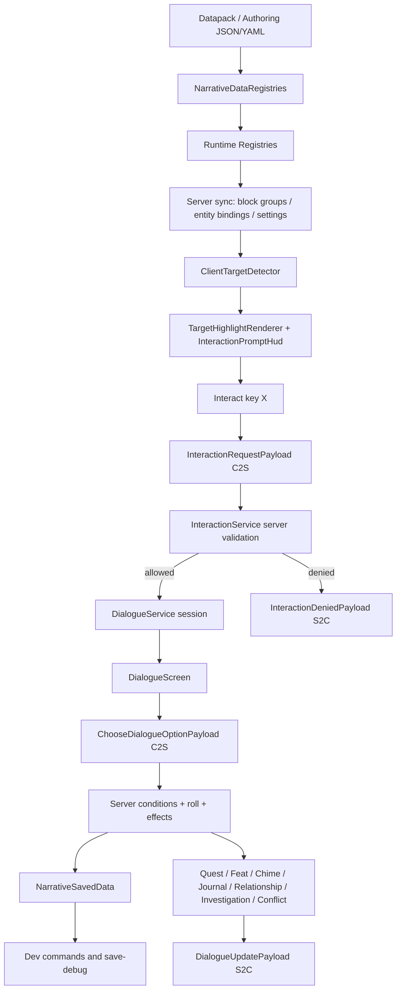

# Esoteric Ebb CRPG Architecture

This document is the maintainable architecture companion to [`GOAL.md`](../GOAL.md). It summarizes the runtime seams that should remain stable as the mod moves from MVP slice to Alpha 0.1.

## Stack and initialization

- Minecraft Java Edition `26.1.2`
- Fabric Loader `0.19.2`, Fabric API `0.150.0+26.1.2`, Loom `1.17.0-alpha.13`
- Java `25`
- GeckoLib `5.5.1`
- Mod id/package/display name: `ebb`, `com.crpg.ebb`, `Esoteric Ebb CRPG`

Common startup belongs in `com.crpg.ebb.EbbMod` and should stay ordered as:

1. `ModEntityTypes.register()`
2. `ModPackets.register()`
3. `NarrativeDataRegistries.registerReloadListeners()`
4. `DialogueService.registerLifecycleEvents()`
5. `InteractionSyncService.registerLifecycleEvents()`
6. `ModCommands.register()`

Client startup belongs in `com.crpg.ebb.client.EbbClient` and must only register client-side systems: key mappings, target detection, client packet receivers, HUD, highlight rendering, GUI screens, and NPC renderers.

## Runtime flow



## Data layer

Story logic should live in data, not Java scene code. The core registry hub is `NarrativeDataRegistries`, backed by reload-safe typed registries:

- `dialogues/**` → `DialogueRegistry`
- `interactions/block_groups/**` → `BlockGroupIndex`
- `interactions/entity_bindings/**` → `EntityBindingRegistry`
- `interactions/settings/**` → `InteractionSettings`
- `attributes/**`
- `npc_routines/**` → `NpcRoutineRegistry`
- `quest_branches/**` → `QuestBranchRegistry`
- `feats/**` → `FeatRegistry`
- `chimes/**` → `ChimeRegistry`
- `journal_entries/**` → `JournalEntryRegistry`
- `relationships/**` → `RelationshipRegistry`
- `clues/**`, `investigation_scenes/**` → `InvestigationRegistry`
- `conflicts/**` → `ConflictRegistry`

Every registry must reject invalid IDs or missing references, collect validation messages instead of crashing `/reload`, appear in `/ebb data` and `/ebb dev` or an equivalent inspection path, and have smoke/static/JUnit/GameTest coverage.

## Interaction layer

Interaction is embodied and server-authoritative:

- Client detection scans crosshair targets and may predict highlight/prompt only from synced block groups, explicit entity bindings, or explicitly enabled debug fallback.
- Highlight range defaults to about 10m; interaction range defaults to about 2m and can be overridden per target/binding.
- Server validation rechecks spectator state, target existence, dimension, distance, line of sight, block predicates, and entity binding matches.
- Material action choices can revalidate the original target again during dialogue choice resolution.
- Unbound vanilla mobs must not become interactable in demo/release data.

Key classes: `InteractionTarget`, `BlockGroupTarget`, `EntityTarget`, `BlockGroupIndex`, `InteractionSettings`, `InteractionService`, `ClientTargetDetector`, `ClientBlockGroupIndex`, and `ClientEntityTargetIndex`.

## Networking layer

`ModPackets` owns payload type registration and server receiver registration. Client receivers stay under `src/client/java`. Current packet families include interaction request/denial/open, dialogue choose/update/close/roll, dev snapshots, journal, quest tree, and sync payloads for block groups/entity bindings/entity targets/settings.

Network rules:

- Never trust payload target IDs or option IDs without server validation.
- Keep explicit packet count limits for synced data.
- Resync on join/reload and clear client prediction state on disconnect/world leave.
- Do not load client-only classes on a dedicated server.

## Dialogue and roll runtime

`DialogueService` opens a server session, applies node enter effects, resolves Chimes, sends visible choices, processes C2S choices, resolves server-side d20 checks, applies pre-roll/outcome effects, marks single-use choices, advances nodes, and releases NPC focus on close/timeout.

The roll identity is:

```text
d20 + attribute + static_modifier + feat_modifier + clue_modifier >= DC
natural 20 = critical_success
natural 1  = critical_failure
advantage = roll two d20, take higher
```

High-stakes checks must fail forward: a failure branch/effect should add clue/state/cost/relationship/conflict/route content rather than simply blocking progress.

## Narrative state

`NarrativeSavedData` is the persistence boundary. Player state includes attributes, unspent points, flags, variables, Branch/Major/Minor story variables, quest states, feats, relationships, NPC memory tags, journal entries, discovered clues, scene state, and conflict scores. World state carries shared flags/vars, Branch/Major/Minor vars, and world NPC state tags.

Rules:

- Player scope: knowledge, thoughts, build, and personal relationship perception.
- World scope: objective/shared scene or route commitments.
- Mark saved data dirty on every mutation.
- Add schema-version/migration tests when persisted shape changes.
- Surface player-visible state changes via dialogue status echo or a UI surface.

## Product systems

- **Story variables:** Branch/Major/Minor layers prevent major decisions from becoming an uncontrolled flat flag bag.
- **Quest/Take Root/Feat:** major branches should permanently shape build or roleplay through feats, traits, chime unlocks, relationship modifiers, or check modifiers.
- **Chimes:** build-personality voices triggered by node tags and player attribute/build state; they render as distinct passive inserts and can unlock thought paths.
- **Journal/clues:** journal records clues, scene notes, leads, and quest notes; clues can modify later checks and must echo when gained.
- **Investigation/conflict:** clues, scene phases, stress/resolve, and fail-forward set-piece dialogue form the CRPG conflict surface.
- **Relationship/NPC memory:** relationship scores and NPC state tags drive reactive dialogue and routines.
- **NPC routines:** `ebb:npc` keeps data-driven routines and lightweight GeckoLib hooks; active dialogue pauses movement and uses line-of-sight-aware look-at/focus.

## Authoring boundary

Runtime JSON lives under `src/main/resources/data/ebb/**`. Authoring YAML/JSON examples live under `authoring/**` and compile with:

```bash
scripts/compile_authoring_sources.py --clean
```

Generated authoring output defaults to `build/generated/ebb_authoring/data/ebb/` and should not mutate bundled runtime data unless explicitly applied.

## Verification contract

Before claiming architectural completion, prefer running:

```bash
python3 scripts/goal_static_audit.py
python3 scripts/deep_research_static_audit.py
python3 scripts/third_review_static_audit.py
scripts/compile_authoring_sources.py --clean
scripts/gradle-local.sh --no-daemon test
scripts/gradle-local.sh --no-daemon validateEbbData
scripts/gradle-local.sh --no-daemon runGametestServer --args nogui
scripts/run_smoke_checks.sh
git diff --check
```

GUI claims require either the GUI automation or a human run against the refreshed jar/profile.
