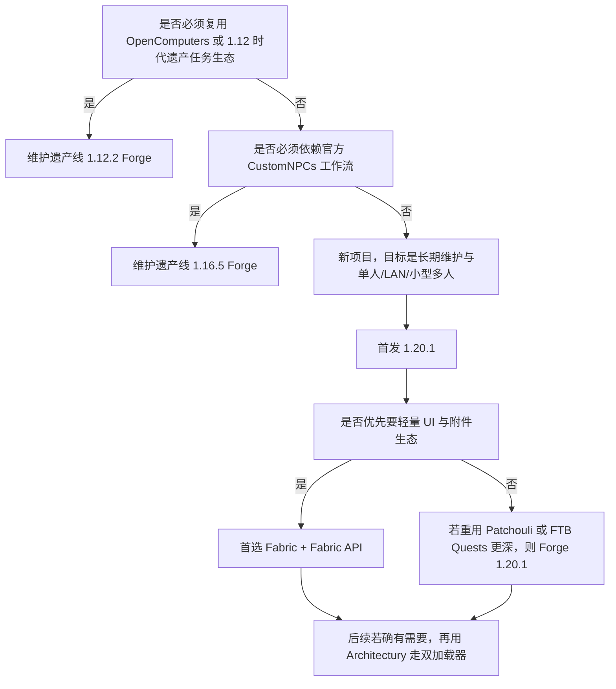

# 在 Minecraft 中实现类极乐迪斯科风格 CRPG 新模组的版本选择与技术栈研究

## 执行摘要

若你在 2026 年新做一款受《极乐迪斯科》启发的 Minecraft Java 版 CRPG 模组，最稳妥的首发组合是 **Minecraft 1.20.1 + Fabric + Fabric API + 自研叙事核心**，辅以 **Cardinal Components / owo-lib / GeckoLib**；**Ink、Yarn Spinner 更适合做作者侧写作工具，而不是直接当 JVM 运行时依赖**。只有在你**必须**复用官方 CustomNPCs 或 OpenComputers 等遗产生态时，才应退回 1.16.5 或 1.12.2。 citeturn39search1turn39search4turn3search0turn3search1turn6search0turn8search2turn17search1

## 核心玩法拆解与实现边界

把《极乐迪斯科》式 CRPG 搬进 Minecraft，真正困难的不是“能不能做对话框”，而是**能否把叙事状态、角色构筑、条件判定、多人同步和作者工具链放进同一套稳定架构**。Minecraft 原生已经提供了 GUI、声音、资源包、数据包、世界存档和网络同步基础；Fabric/Forge 文档也分别覆盖了 GUI、网络、保存数据、国际化与自动化测试等能力，因此“新模组 + 自研 CRPG 内核”是技术上可行的路线。citeturn23search1turn23search4turn34search0turn34search1turn34search2turn35search5turn35search0turn26search0turn25search1

从玩法上看，你至少要把“世界状态”和“叙事状态”分开。前者是方块、实体、维度、任务触发器；后者是对话节点、内心独白频道、技能检定结果、派系/信念变量、任务旗标、结局锁。前者可以继续利用 Minecraft 的实体与世界系统，后者则应该由你自己的**叙事状态机**完全托管，否则后期会被老式任务模组的数据模型反噬。citeturn34search1turn34search2turn35search3turn34search5

下表给出建议的“玩法要素—实现方式—是否应自研”的映射：

| 玩法要素 | Minecraft 内实现建议 | 可复用依赖 | 建议 |
|---|---|---|---|
| 对话系统 | 自定义 `Screen` / 菜单 + 服务端权威对话状态机；节点、选项、条件、效果全部数据驱动 | owo-lib 或 LibGui 可加速 UI；原生 Screen 也足够 | **必须自研核心**；UI 可借库。citeturn34search0turn3search1turn31search11turn32search1 |
| 技能树 / 属性 / 信念 | 玩家级数据附件或能力系统，服务端计算、客户端只展示 | Fabric 路线可用 Cardinal Components；Forge 路线可用 Capabilities | **必须自研规则层**；底层存取可复用。citeturn34search2turn3search0turn35search3 |
| 属性判定 / 骰点 / 被动检定 | 统一“检定请求”接口，区分硬判定、软判定、隐式判定；结果写入叙事日志 | 无现成模组能完整覆盖，最多借 KubeJS 做原型 | **必须自研**。citeturn20search0turn20search1 |
| 任务 / 分支剧情 | 将“任务树”和“剧情图”分离；任务是可追踪目标，剧情是状态图 | FTB Quests / Odyssey 可做原型或支线模板 | **主线建议自研**；现成任务模组更适合原型和侧内容。citeturn10search0turn10search1turn11search0turn11search1 |
| 对话选项与内心独白 | 选项节点支持多个“发言频道”；把“内心技能人格”建模为多个 speaker/channel | 无直接现成依赖 | **必须自研**。 |
| 非线性结局 | 世界级 Saved Data 中维护结局条件集与世界快照引用 | Saved Data / 附件系统 | **自研**，但存储层复用官方能力。citeturn34search1turn34search2turn34search5 |
| UI / 对话框 / 检定反馈 | 单独做全屏 CRPG 界面，不要硬套书本或聊天框 | owo-lib、LibGui；Patchouli 只适合百科/案卷册 | **UI 可借库，主交互不要寄托于 Patchouli**。citeturn3search1turn32search1turn7search0turn7search1 |
| 存档 / 剧本管理 | 内容放 JSON/数据包；运行时状态放 Saved Data；玩家短期状态放附件/能力 | Fabric Saved Data / Data Attachments；Forge Saved Data / Capabilities | **内容与状态分离**。citeturn34search1turn34search2turn34search5turn35search3 |
| 音效 / 音乐触发 | 按对话节点、检定阶段、场景标签触发 SoundEvent；角色肖像动画可挂音效关键帧 | GeckoLib 的 sound / particle / event keyframes | **可复用 GeckoLib**。citeturn6search0turn6search1 |

一个重要结论是：**现成任务/NPC 模组可以显著缩短原型期，但不适合作为“类极乐迪斯科 CRPG”的最终运行时主干**。原因并不是它们不好，而是它们普遍围绕“任务追踪”“NPC 编辑”“书本展示”“RPG 物品/职业”建模，而不是围绕“复杂叙事状态机 + 内心独白 + 非线性收束 + 可迁移的剧情 DSL”建模。FTB Quests、Odyssey、Patchouli、CustomNPCs 都非常有用，但都更适合承担**原型、编辑器、附属系统**，而不是最终的叙事心脏。citeturn10search0turn10search1turn11search0turn11search1turn7search0turn8search2turn9search1

## 依赖与前置模组清单

### 适合直接纳入首发架构的依赖

| 名称 | 用途 | 优点 | 短板 | 兼容性与活跃度 | 开源与官方来源 |
|---|---|---|---|---|---|
| Fabric Loader + Fabric API | 首发加载器与基础 API | 生态轻量，文档清晰，Fabric API 覆盖事件、数据生成、测试等常用能力 | 若你强依赖部分 Forge 传统库，则需要移植或换方案 | Fabric API 仍持续更新，覆盖 1.20.x 到最新版本 | Apache-2.0；官方文档/项目页/源码。citeturn23search4turn24search0turn39search1turn39search4 |
| Forge | 传统大生态加载器 | 与大量旧有 RPG/任务类模组兼容；1.20.1 仍是成熟目标版本 | 新项目若只做自定义叙事，依赖面通常比 Fabric 更重 | 1.20.x 文档完整；1.20.1 仍是实际常用版本 | 官方文档与项目。citeturn23search1turn35search1turn35search5 |
| Architectury API | 双加载器抽象层 | 抽象事件、网络、注册与平台差异，降低未来移植成本 | 早期就引入会增加复杂度；若不计划双端，则是额外负担 | 仍支持 1.16.5 到 1.21.x，多加载器活跃 | LGPL-3.0；官方文档/源码/项目页。citeturn4search0turn4search1turn4search7 |
| Cardinal Components API | Fabric/Quilt 的玩家/实体/世界数据附件 | 数据附着、保存、同步都成熟，适合角色构筑与剧情旗标 | 仅 Fabric/Quilt；若转 Forge 需换适配层 | 覆盖 1.20.x 且 2026 仍更新 | MIT；官方仓库/项目页。citeturn3search0turn3search3 |
| owo-lib | Fabric UI、配置与实用库 | owo-ui 很适合做复杂动态屏幕；配置和通用工具齐全 | 更偏 Fabric 体验；若做双加载器需谨慎隔离 UI 层 | 1.20.x–1.21.x 持续更新 | MIT；官方仓库/项目页。citeturn3search1turn31search11 |
| GeckoLib | 角色立绘替身、NPC 动画、音效关键帧 | 支持实体、方块、物品、音效/粒子/事件关键帧；Blockbench 工作流成熟 | 高版本渲染管线变化会带来升级成本 | Forge/Fabric/NeoForge 多加载器，1.20.1 和新版本都活跃 | MIT；官方仓库/wiki/项目页。citeturn6search0turn6search1turn6search2turn5search0turn5search4 |
| KubeJS | 原型阶段快速脚本、事件编排、临时剧情钩子 | 迭代快，方便验证条件、奖励、世界事件 | 最终主线若过度依赖 JS，会增加多人同步与调试复杂度 | 1.20.x 及更新版本活跃 | LGPLv3；官方项目页。citeturn20search0turn20search1 |

### 更适合原型、附属系统或特定条件下使用的依赖

| 名称 | 用途 | 优点 | 短板 | 兼容性与活跃度 | 开源与官方来源 |
|---|---|---|---|---|---|
| Patchouli | 设定集、案卷册、百科、日志书 | 数据驱动文档非常成熟，适合“案件档案”“技能说明书” | 不是完整 CRPG 对话框；现代 1.20.1 文件以 Forge 为主，Fabric 路线不应押宝它 | 1.20.1 Forge、后续 NeoForge 仍更新 | 源码公开，许可为自定义；官方仓库/项目页。citeturn7search0turn7search1turn7search2 |
| FTB Quests | 任务树、支线目标、原型任务流 | 轻量、成熟、团队/多人友好，适合快速做目标与奖励 | 叙事状态机表达力有限；许可为 All Rights Reserved，更适合作为独立任务模组而非内嵌核心 | 1.20.1 Fabric 与 Forge/NeoForge 仍活跃 | 官方项目页。citeturn10search0turn10search1turn10search2 |
| Odyssey Quests | 开源任务树替代方案 | MIT 开源，1.20.1 同时支持 Fabric/Forge，树状任务定义明确 | 最近更新频率低于 FTB 路线，更适合参考其配置与数据结构 | 固定在 1.20.1 版本线 | MIT；官方项目页。citeturn11search0turn11search1turn11search3 |
| CustomNPCs 官方版 / 非官方移植版 | NPC、对话、任务、脚本原型 | 原型效率极高，很多 RPG 地图作者熟悉其工作流 | 官方线停在 1.16.5；现代版本主要依赖非官方移植；脚本式内容不利于 Git 与 CI 管理 | 官方 1.16.5；非官方项目支持 1.20.1+ | 官方 API/示例开源；移植版项目页可见，但源码公开性不如前述基础库清晰。citeturn8search2turn8search4turn9search0turn9search1turn9search2turn9search3 |
| CC:Tweaked | 可编程终端、侦探笔记本、世界内计算机 | 若你想做“档案终端/控制台/打字机式界面”，它非常有启发性 | 不是 CRPG 主干；近年分发重心转向 Modrinth/GitHub | 覆盖 1.20.1 与更高版本，多加载器 | 源码公开；官方仓库/项目页。citeturn15search0turn16search0turn16search3 |
| OpenComputers | 世界内计算机与 Lua 脚本 | 如果你一定要“硬核世界内电脑”，它仍然强大 | 基本锁在 1.12.2 Forge；不适合新主线项目 | 仅 1.12.2 Forge 现实可用 | MIT；官方仓库/项目页。citeturn17search1turn17search2turn18search0 |
| CB Multipart / MCMultiPart | 多部件方块 | 可做电话、控制台、拼装式交互物件 | 对 CRPG 并非核心；MCMultiPart 已停在 1.12.2 | 现代是 CB Multipart；旧线是 MCMultiPart | 开源；官方项目页。citeturn19search0turn19search1turn19search2 |
| MMOItems / SkillAPI | 职业/技能/物品配置思路 | 若你改做 Paper/Spigot RPG 服务器，可借鉴配置思路 | **它们属于 Bukkit/Paper 插件生态，不是 Java 客户端模组前置**，不适合作为本项目主依赖 | SkillAPI 已多年未更新；MMOItems 是服务器插件路线 | SkillAPI MIT；MMOItems 官方 GitLab/Spigot 文档可见。citeturn12search0turn12search2turn14search0turn14search1 |

综合判断，**真正应该稳定放进首发“底盘”的，只有加载器/API、数据附件、UI 库、动画库，以及少量原型脚本工具**。任务模组、NPC 模组、文档书模组都应被放在“作者工具”或“可替换外设”的位置，而不是底层架构中心。citeturn3search0turn3search1turn6search0turn10search0turn11search0turn8search2turn7search0

## 版本选择与推荐路线

从“模组生态成熟度、API 稳定性、性能、服务端/客户端兼容性、现有依赖支持情况”综合看，**1.20.1 是当前最均衡的首发版本**。原因不是它“最新”，而是它同时得到 Fabric API、Architectury、GeckoLib、FTB Quests、Odyssey、KubeJS、CC:Tweaked，以及多个实用库的覆盖；同时 NeoForge 官方还明确写到：虽然 NeoForge 存在 1.20.1 版本，但这条线上更推荐使用 Forge，而 1.20.5 以后又会切到 Java 21，这使 1.20.1 成为一个很适合“先把玩法做稳”的平台。citeturn39search1turn39search4turn4search0turn5search4turn10search0turn10search1turn11search0turn20search0turn15search0turn23search2turn23search6

上图的核心判断依据是：OpenComputers 基本现实可用版本仍是 1.12.2；官方 CustomNPCs 现实终点是 1.16.5；而现代库与工具则高度聚集在 1.20.1。citeturn17search1turn18search0turn8search2turn39search1turn4search0turn10search0turn11search0

### 版本对比

| 版本 | 何时选择 | 优势 | 主要代价 | 结论 |
|---|---|---|---|---|
| 1.12.2 | 你**必须**复用 OpenComputers、MCMultiPart 或经典 1.12 任务生态 | 遗产模组多，OpenComputers 仍可用 | API 老、迁移成本高、现代 UI/测试/国际化工作流更差 | **只做遗产分支，不做首发主线**。citeturn17search1turn18search0turn19search1 |
| 1.16.5 | 你**必须**依赖官方 CustomNPCs 原始工作流 | 官方 CustomNPCs 终点在此，生态仍算稳定 | 已明显老化；若未来转 1.20+，重写量大 | **只在强依赖 CustomNPCs 时使用**。citeturn8search2turn28search0 |
| 1.20.1 | 新项目首发、强调长期维护与多人同步 | 依赖覆盖最均衡；Java 17 基线稳；库最多 | Fabric/Forge 之间仍有分裂，需要前期定线 | **首选版本**。citeturn39search1turn39search4turn4search0turn5search4turn10search0turn10search1turn11search0turn20search3turn39reddit38 |
| 1.21+ / 26.1 | 你已经有稳定核心，想追最新内容与后续上游 | Fabric API、Cloth、YACL、GeckoLib 等都已跟进 | Java 21/渲染管线与工具链变化更快；GeckoLib 5 也明确提到 1.21.5+ 受 Mojang 渲染改动影响而有较大升级成本 | **适合作为二期迁移目标，不建议做首发**。citeturn23search2turn30search0turn33search1turn6search6 |

最终建议可以明确写成一句话：**首发做 1.20.1；若你偏向纯自定义叙事内核与 UI，则首发 Fabric；若你想更深复用 Patchouli/FTB Quests 或既有 Forge 包生态，则首发 Forge 1.20.1。** citeturn7search1turn10search0turn10search1turn23search2

## 技术栈与开发流程建议

### 推荐技术栈

| 层 | 推荐方案 | 说明 |
|---|---|---|
| 开发语言 | **Java 17 为主**，Kotlin 仅作可选增强 | 现有模组工具链与主流开源项目大多以 Java 为主；1.20.1 实务上用 Java 17 最稳。citeturn23search6turn39reddit38turn24search0turn4search1turn6search0 |
| 构建工具 | **Gradle**；Fabric 用 Loom，双加载器再引入 Architectury Loom/Plugin | Fabric Loom 是官方 Gradle 插件；Architectury 文档也围绕其多加载器工具链展开。citeturn24search0turn24search3turn4search7turn4search5 |
| IDE | **IntelliJ IDEA** 优先 | Forge 文档和 Architectury 生态都对 IntelliJ 友好；VS Code 更适合作者脚本与文案编辑。citeturn23search5turn4search7 |
| UI 层 | **原生 Screen + owo-ui**；若需要大量槽位/窗口部件，可评估 LibGui | CRPG 对话界面通常不是传统容器 GUI，先用原生 Screen/绘制更稳，再用 owo 或 LibGui 降低样板代码。citeturn34search0turn3search1turn31search11turn32search1 |
| 存档与状态 | 世界级 `Saved Data` + 玩家/实体级附件或能力 | 内容定义与运行时状态分离；单人和 LAN/小型多人都受益。citeturn34search1turn34search2turn34search5turn35search3 |
| 网络 | **服务端权威**；客户端只负责展示与输入；Fabric Networking 或 Forge SimpleImpl | 对话选择、判定、任务推进都由服务端确认，避免多人分歧。citeturn35search5turn35search0 |
| 资源打包 | UI 纹理、头像、音频走资源包；剧情定义、任务定义、条件与结局走数据包/JSON；用 datagen 生成能生成的资源 | Fabric/Forge 都有数据生成工作流，适合语言文件、进度、模型、战利品等。citeturn37search0turn37search5turn37search10turn26search2 |
| 作者工具 | **自定义 JSON IR 为运行时真源**；Ink / Yarn Spinner 作为作者侧写作工具或中间表示 | Ink 与 Yarn Spinner 官方核心都偏 C#/.NET/Unity/Godot/Unreal 生态，不应直接假设为 JVM 原生运行时。citeturn21search1turn21search3turn38search0turn38search1 |
| 动画与视听 | GeckoLib + Blockbench + 自定义音频 cue map | NPC 立绘替身、过场物、互动对象都能统一资产流程。citeturn6search0turn6search2turn6search3 |

这里最关键的选择，不是 Fabric 还是 Forge，而是**你是否愿意从第一天就把“剧情 DSL、状态机、判定系统、同步协议、存档模式”设计成自己的核心资产**。如果答案是“是”，那么依赖生态会从“决定你能做什么”变成“帮你更快地做”。这会极大降低你将来在版本升级时被依赖绑架的概率。citeturn34search1turn34search2turn35search5turn4search7

### 对话编辑器与剧本格式建议

对新模组而言，最稳的方案并不是直接把 Ink 或 Yarn Spinner 嵌进 Minecraft，而是采用三层结构：

1. **作者层**：编剧可用 Ink、Yarn Spinner，或你自己的可视化编辑器写分支文本。  
2. **构建层**：在 CI/本地转换成你自己的 **JSON 中间格式**。  
3. **运行层**：Minecraft 模组只解释你自己的 JSON IR，而不直接解释第三方写作工具的官方运行时。  

这样做的原因是：Ink 的官方开源仓库清晰表明它的核心构建与运行环境围绕 .NET/C#；Yarn Spinner 官方也把“正式支持的包”明确放在 Unity、Unreal、Godot 等引擎集成上，而不是 JVM Minecraft。对 Java 模组来说，把它们当“作者工具”而不是“运行时依赖”，会显著降低维护成本。citeturn21search1turn21search0turn38search0turn38search1

如果团队很小，甚至可以**直接从自定义 JSON + JSON Schema 开始**。这样你会失去一点作者体验，但会得到最强的稳定性、最简单的 CI、最清晰的多人同步和最容易做版本迁移的内容格式。由于 Fabric 与 Forge 都支持数据生成、语言资源和数据驱动内容，你完全可以把“剧情内容”视作一种特殊的数据包资源。citeturn37search0turn25search3turn26search0

### 工作流与工程工具链

版本控制建议使用 Git，并把代码与内容彻底分仓或至少分目录：`common/` 放引擎与规则，`content/` 放剧情 JSON，`assets/` 放图像/音频，`tools/` 放转换脚本。CI 推荐至少做四件事：构建、格式检查、单元测试、GameTest。Fabric 文档提供了 Fabric Loader JUnit 与 GameTest 的自动测试路径；Forge 文档则给出了 Game Tests 和 `runGameTestServer` 这类集成测试手段。citeturn25search1turn26search1

调试方面，开发期要同时用**断点调试 + 日志 + 性能分析**。Fabric 文档明确给出了日志、断点、热替换等调试实践；性能分析则强烈建议配 spark，它同时支持客户端、服务端和多个加载器。citeturn25search0turn36search0

国际化不要后补。Forge 和 Fabric 文档都强调了翻译键/语言文件路径与国际化做法；《极乐迪斯科》式作品的文本量极大，如果早期不做键值化和语言资源分离，后期会非常痛苦。citeturn26search0turn25search3

## 可优先参考的项目与实现样本

| 项目 | 可借鉴点 | 为什么值得看 | 官方来源 |
|---|---|---|---|
| Origins | 数据驱动能力、角色选择流程、同步思路 | 非常适合参考“角色特质/缺陷/职业底色”的数据结构，而不是直接照搬玩法 | 仓库与项目页。citeturn29search0turn28search0turn28search1 |
| GeckoLib | 动画、音效/粒子/事件关键帧、Blockbench 工作流 | 适合做 NPC 立绘替身、过场道具、检定动画与场景事件 | 仓库与 wiki。citeturn6search0turn6search1turn6search3 |
| Patchouli | 数据驱动富文本/多页内容展示 | 适合做“案件档案”“技能说明”“世界设定册” | 仓库与项目页。citeturn7search0turn7search1 |
| Odyssey Quests | 开源任务树配置 | 适合参考“任务图的 JSON 化组织形式”，尤其是 1.20.1 双加载器场景 | 项目页。citeturn11search0turn11search1 |
| CC:Tweaked | 世界内脚本系统、终端式交互、Lua 生态 | 若你想做“打字机”“终端”“侦探控制台”，这是最有启发性的现成项目之一 | 仓库与项目页。citeturn16search3turn15search0 |
| KubeJS | 快速事件脚本与原型化 | 非常适合在不改 Java 核心的情况下快速验证剧情钩子与世界响应 | 项目页。citeturn20search0turn20search1 |
| Mine in Abyss | 大型叙事/世界观项目的代码组织与内容工程化 | 它是 Paper 项目而非客户端模组，但非常适合借鉴“大体量内容如何工程化” | 官方站点与仓库。citeturn13search3turn13search0 |
| CustomNPCs scripting examples | NPC 脚本、数据存储、示例工程 | 即便你不把 CustomNPCs 当最终依赖，这个示例仓库也值得当“原型演化教材”看 | 官方示例仓库。citeturn9search3 |

如果你只挑三类来系统阅读，我会优先建议：**Origins 学“数据驱动角色构筑”**，**GeckoLib 学“角色表现与事件驱动动画”**，**Odyssey/FTB Quests 学“任务图结构”**。它们分别对应你最终系统中的“人”“表现”“目标”。citeturn29search0turn6search0turn11search0turn10search0

## 迁移与兼容性规划

版本迁移成本，通常不是死在“API 改了”，而是死在你把**剧情内容、保存格式、网络协议、UI 渲染和加载器细节全搅在一起**。Architectury 文档之所以有价值，不在于它能神奇地消灭移植，而在于它提醒你：**公共逻辑、平台适配、构建与运行入口应该从一开始就分层**。citeturn4search7turn4search1

建议把代码结构至少分成四层：

| 层 | 放什么 | 迁移时的收益 |
|---|---|---|
| `domain` | 对话状态机、技能判定、任务条件、结局逻辑、JSON schema | 绝大多数逻辑可跨版本复用 |
| `content` | 剧本、任务、属性树、结局表、UI 文案 | 版本升级时主要做数据迁移，不重写逻辑 |
| `platform-fabric` / `platform-forge` | 注册、网络、存档接入、附件/能力适配 | 把加载器差异限制在边缘层 |
| `client-ui` | Screen、渲染、输入、动画桥接 | 渲染或 UI API 变动时不波及规则层 |

如果你已经确定“未来大概率会同时发 Fabric 和 Forge/NeoForge”，可以在一开始就采用 common + loader 分模块，并让所有平台差异都通过接口注入。如果你还不确定，就**先做单加载器**，但仍然按照上述四层分离；这样未来再引入 Architectury 也不会太痛。citeturn4search7turn24search0

内容迁移方面，务必做三件事。第一，所有剧情/任务/技能 JSON 都带 `schema_version`。第二，游戏存档中的变量袋与任务状态带 `save_version`。第三，准备一个“迁移器”对旧档做前向转换。Fabric 的 Saved Data 与 Data Attachments、Forge 的 Saved Data/Capabilities 都能承载这种版本化存储思路。citeturn34search1turn34search2turn34search5turn35search3

另外，不要把对话脚本写死到 Java 常量里，也不要把 `Mixin` 当作叙事系统的主要扩展手段。Mixin 对必要的原版钩子很有用，但如果你的主逻辑必须靠到处注入原版菜单、聊天框、字幕、实体逻辑才能跑，那它未来一定很难迁移。高版本渲染变化已经让 GeckoLib 5 必须做较大调整，这正说明“与渲染耦合太深”的代价会在升级时集中爆发。citeturn6search6

## 风险与限制

### 风险矩阵

| 风险 | 具体表现 | 缓解策略 |
|---|---|---|
| 版权与商标 | 若你直接搬运《极乐迪斯科》的原始剧情文本、立绘、音频、Logo 或高度可识别的人物/组织命名，风险会显著上升；本报告仅作一般性提示，**不是法律意见** | 采用“受其启发”的原创世界观、原创文本与视觉资产；正式公开前做一次独立法务审查 |
| 依赖许可与分发 | FTB Quests 为 ARR；Patchouli 为自定义许可；CC:Tweaked 的分发重心已不在 CurseForge；不同库的再分发边界并不相同 | 立项初期就做依赖许可证清单；区分“编译依赖”和“用户需额外安装”的库。citeturn10search0turn10search1turn7search1turn15search0 |
| 多人同步复杂性 | 对话选择、隐式判定、任务旗标、世界状态若不服务端权威，会导致单人正常、联机错乱 | 坚持服务端权威；客户端只做 UI 呈现与输入；所有关键推进都走网络消息与保存层。citeturn35search5turn35search0turn34search1turn34search2 |
| 性能与可扩展性 | 文本系统本身不重，但复杂 UI、频繁同步、动态动画、全局轮询条件会拖垮 TPS/FPS | 事件驱动替代轮询；对话条件缓存；性能问题用 spark 实测而不是猜。citeturn36search0turn25search0 |
| 模组冲突 | UI 库、动画库、脚本工具与别的内容模组叠加后，容易出现渲染、依赖版本或同步冲突 | 保持核心依赖最小化；把剧情主干尽量自有化；引入第三方库时先做最小实例验证。citeturn6search6turn3search3turn30search0 |
| 版本升级 | 1.21+ 的渲染与 Java 基线变化更快；越晚抽离平台与内容，升级越痛 | 以 1.20.1 首发；先把内容 schema 化，再谈升级。citeturn23search2turn6search6 |

最后需要坦诚一点：**Minecraft 很适合承载“受《极乐迪斯科》启发的叙事结构”，但并不天然适合承载“完全复刻《极乐迪斯科》的 UI、节奏和文本密度”**。这不是坏事，反而意味着你最成功的方案，通常不是“尽量像原作”，而是“在方块世界里重做一种侦探式、意识流、检定驱动的 CRPG 体验”。技术上应该做的是保留其结构精神——多声道内心独白、属性人格化、分支与收束、世界状态回写——而不是把原作界面一比一贴到 Minecraft 上。